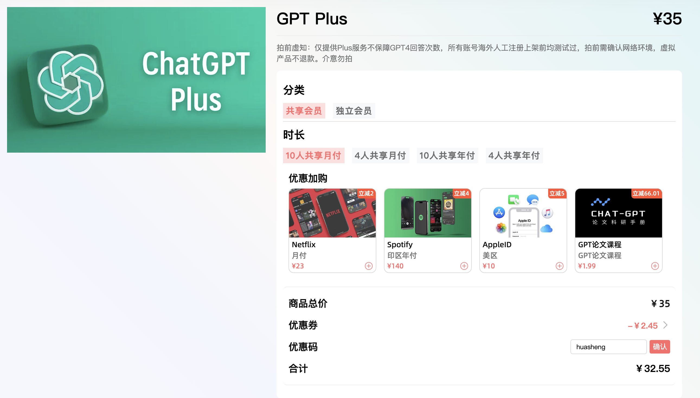
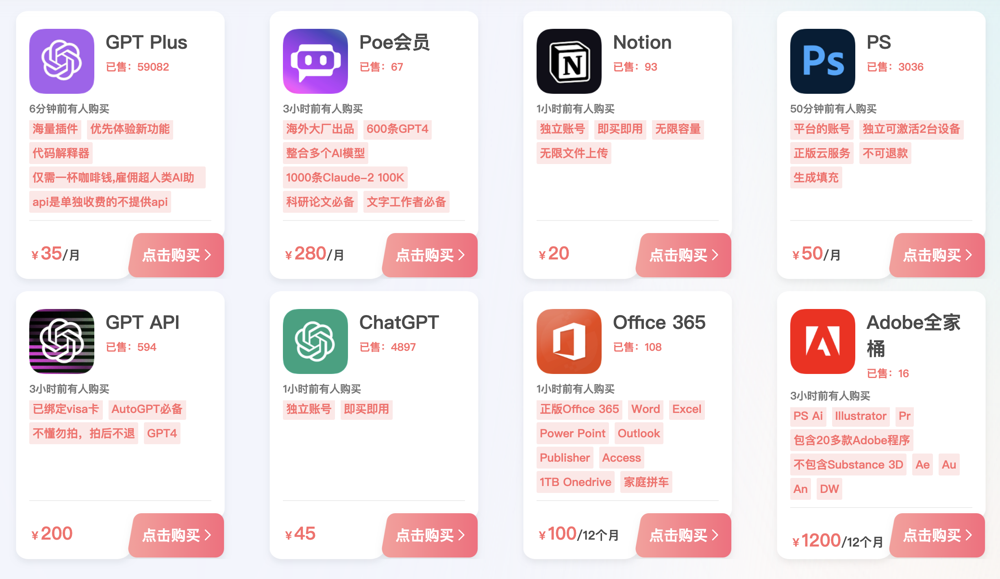

# ChatGPT Plus会员合租拼车购买渠道推荐

这篇文章主要提供两个解决ChatGPT账号注册和ChatGPT Plus会员购买的两个渠道：

1、银河录像局：https://nf.video/bj3tjn	

2、环球巴士：https://universalbus.cn/?s=5HCba2gPfO

这两个渠道目前都提供便宜的ChatGPT Plus多人合租和独享账号这两种方式，你可以对比价格判断哪个渠道更合适。

我跟他们合作了一段时间，都属于还比较靠谱的平台，提供的账号都是真实有效的，如果遇到问题，也有客服会随时提供解决方案，能退款，所以给各位申请了优惠码福利，两个平台，你在结算的时候输入优惠码“huasheng”都能获得优惠。

如果你只是尝鲜的目的，可以先购买10人合租或4人合租的版本，但是因为目前ChatGPT本身对Plus会员的限制是3小时40次，所以越多人合租，你也就越容易受到限制。

目前两个平台独享账号的价格还比较贵，如果你短期使用我觉得没问题，但是你确定自己要长期使用，想要获取自己的ChatGPT Plus会员账号的话，我会比较建议你通过去申请一张境外银行卡长期解决这个问题，你可以参考我的新加坡华侨银行OCBC线上0成本申请教程：https://www.bookai.top/docs/another-tutorial/OCBC

## 一、这篇文章的背景

我从2023年3月份GPT-4发布后，开始在B站/Youtube开始制作ChatGPT相关使用技巧的视频，至今已经做了20多个视频。

但是我发现对不少人来说，面临的最大的问题依然是：

1、ChatGPT的官网是什么，怎么用上ChatGPT？

2、GPT-4比GPT3.5到底强多少，值不值得购买Plus会员？

3、怎么购买Plus会员？

当我现在在B站搜索ChatGPT，排在前列的搜索结果中，除了我介绍ChatGPT使用技巧的视频外，其他大多数教人如何使用上ChatGPT的，尤其是免费使用GPT-4的教程相当火爆。

但是，你有没有想过，免费的可能是最贵的。当你使用一个产品不需要付费的时候，也许你就是那个产品提供的服务本身？

## 二、ChatGPT使用与付费的难题

其实我很理解大家使用ChatGPT的困难，因为在国内，你想用上官方版本的GPT-4存在重重障碍：

- 首先，中国不在OpenAI提供服务的国家范围内，所以当你在国内访问ChatGPT官网时，你看到的页面是这样的；
- 接着，假设你克服了重重障碍，访问成功了。当你想要注册时，你会发现qq、163等国内邮箱不在他们支持的范围内；
- 然后，你用了gmail等国外邮箱，你还会发现根本没法用国内手机号注册，你可能还需要找个接码平台，注册付费，折腾半天。
- 最后，假设你把注册和使用都搞定了，但是你依然只能使用最基础的ChatGPT，也就是GPT-3.5的版本，要用GPT-4又会是个大困难，你需要国外的银行卡账户才可以。

## 三、我自己的解决方式，供参考

上面说的这些困难，其实都有解决方式，如果你是个动手能力极强，又很有时间的人，我建议你现在也是可以退出视频搜功能解决这个问题了。

我不是，其实我是个一直以来非常愿意为优质的服务和节省时间花钱的人：

1、我最早的一个ChatGPT账号是去年12月在某宝花59元买的，后来还是在我出国旅行的时候我才靠国外的手机号成功注册了我自己的账号。我当然知道有免费或者更低价的注册方式，比如使用国外手机号的接码平台，但是对我来说，时间成本才是更大的成本，我愿意花钱快速解决一些问题。

2、而我在OpenAI发布GPT-4的第一天就立马购买了ChatGPT plus会员，每个月20美元的月费付得很开心，至今没有中断过。很多人没有花时间花精力解决GPT-4付费的原因是不知道这个模型能力如何，自己是否有足够的需求场景。

对我来说，我一直没有这种怀疑，我每天都有大量需要做的事情能得到GPT-4的帮助，我有许多好奇心和困惑想要与ChatGPT探讨。

## 四、银河录像局的资质介绍

[银河录像局](https://nf.video/bj3tjn)是一家新兴的流媒体和AI工具合租拼车平台，主要提供各类流媒体与生产力工具的合租服务，如Netflix、Disney+、HBO、AppleTV+、Midjourney、ChatGPT、PrimeVideo等。这个平台由杭州崇宇信息科技有限公司运营，实力不错，已经服务过10万+客服，并在各大社交媒体平台上有账号。他们的服务目标是为广大用户提供卓越的在线娱乐与生产力解决方案，致力于提供便捷、高效且稳定的服务。

银河录像局的特点和优势包括：

1. **多样化的服务**：提供多种流媒体和AI工具账号合租服务，覆盖视频、音乐、游戏、教育、设计、编程等领域。
2. **智能匹配和共享机制**：用户可以根据个人喜好和预算选择合适的账号，并与他人共享使用权和费用。
3. **优质的资源和技术**：保证用户的使用体验和数据安全，提供专业的客服和反馈渠道。
4. **丰富的流媒体服务种类**：包括Netflix、Apple One、Disney+、Spotify、TIDAL、Youtube、Prime Video、HBO GO、HBO MAX、Paramount等。
5. **AI百宝箱**：包括Midjourney和ChatGPT Plus等多种热门人工智能服务，提供多人合租选择。

## 五、环球巴士的资质介绍

[环球巴士（UniversalBus）](https://universalbus.cn/?s=5HCba2gPfO)是一个提供一站式流媒体合租服务的平台。该平台主要专注于提供包括Netflix、Spotify、Tidal、HBO、HBO GO、YouTube、Disney+等在内的流媒体账号合租服务。环球巴士的服务特点包括自动化交付、无忧售后服务，以及贴心的价格策略。

这个平台原名是奈飞站，现在也拓展了ChatGPT Plus会员、Midjourney、POE等AI工具的账号共享服务。

